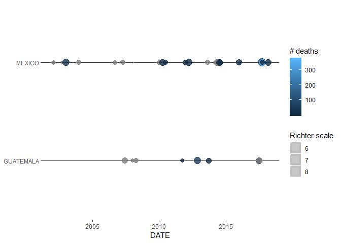
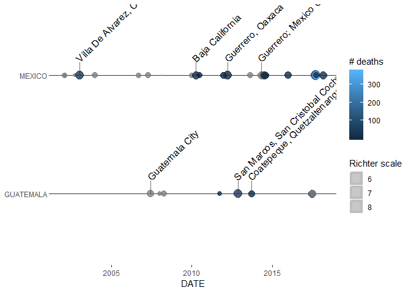

<!-- README.md is generated from README.Rmd. Please edit that file -->
Rproj - NOAA
============

The goal of Rproj - NOAA is to allow easy reporting of eartquakes database.

Installation
------------

You can install the released version of farsReport from [GitHub](https://github.com/bsleczko/Rproj) with:

``` r
devtools::install_github("https://github.com/bsleczko/farsReport")
```

Current status of build: [](https://travis-ci.org/bsleczko/Rproj)

NOAA reporting
==============

Plot Geom\_timeline
-------------------

``` r
noaa_df <- read.delim(file = "inst/extdata/signif.txt", stringsAsFactors = FALSE) %>%
  eq_location_clean() %>%
  dplyr::mutate(DATE = paste(YEAR, NAto01(MONTH), NAto01(DAY), sep = "-")) %>% 
  dplyr::filter(COUNTRY == "MEXICO" | COUNTRY == "GUATEMALA") %>% 
  dplyr::filter(lubridate::year(DATE) >= 2000)


ggplot(noaa_df, aes(x = as.Date(DATE), y = COUNTRY,
                    color = as.numeric(TOTAL_DEATHS),
                    size = as.numeric(EQ_PRIMARY))) +
  geom_timeline() +
  labs(size = "Richter scale", color = "# deaths") +
  ggplot2::theme(panel.background = ggplot2::element_blank(),
                 legend.position = "right",
                 axis.title.y = ggplot2::element_blank()) +
  ggplot2::xlab("DATE")
```



Plot Geom\_timeline\_label
--------------------------

``` r
noaa_df <- read.delim(file = "inst/extdata/signif.txt", stringsAsFactors = FALSE) %>%
  eq_location_clean() %>%
  dplyr::mutate(DATE = paste(YEAR, NAto01(MONTH), NAto01(DAY), sep = "-")) %>% 
  dplyr::filter(COUNTRY == "MEXICO" | COUNTRY == "GUATEMALA") %>% 
  dplyr::filter(lubridate::year(DATE) >= 2000)

ggplot(noaa_df, aes(x = as.Date(DATE), y = COUNTRY,
                    color = as.numeric(TOTAL_DEATHS),
                    size = as.numeric(EQ_PRIMARY),
                    label = LOCATION_NAME)) +
  geom_timeline() +
  labs(size = "Richter scale", color = "# deaths") +
  ggplot2::theme(panel.background = ggplot2::element_blank(),
                 legend.position = "right",
                 axis.title.y = ggplot2::element_blank()) + ggplot2::xlab("DATE") +
  geom_timeline_label(data = noaa_df)
#> Warning: Removed 3 rows containing missing values (geom_timeline_label).
```



Plot map
--------

``` r
noaa_df <- read.delim(file = "inst/extdata/signif.txt", stringsAsFactors = FALSE) %>%
  eq_location_clean() %>%
  dplyr::mutate(DATE = paste(YEAR, NAto01(MONTH), NAto01(DAY), sep = "-")) %>% 
  dplyr::filter(COUNTRY == "MEXICO" | COUNTRY == "GUATEMALA") %>% 
  dplyr::filter(lubridate::year(DATE) >= 2000)

noaa_df %>% 
  dplyr::mutate(popup_text = eq_create_label(.)) %>% 
  eq_map(annot_col = "popup_text") %>%
  print()
```
