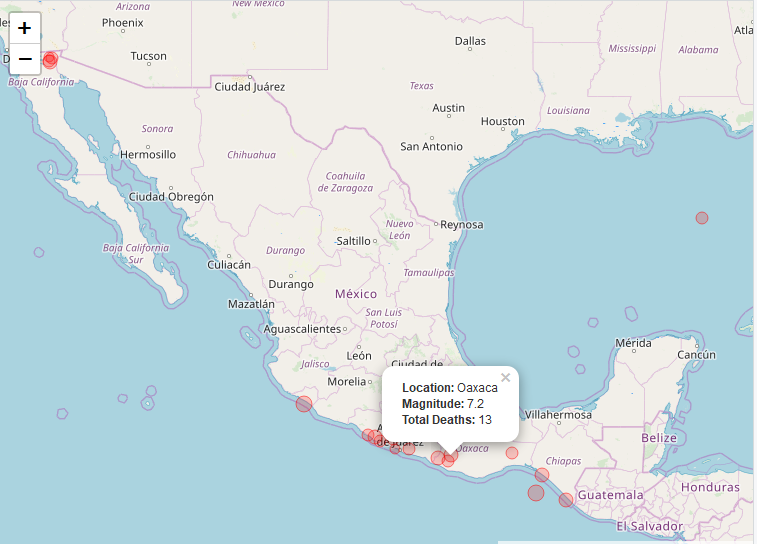

```{r setup, include = FALSE}
knitr::opts_chunk$set(
  collapse = TRUE,
  comment = "#>"
)
```


# NOAA reporting

## Plot Geom_timeline
```{r, fig.show='hold'}
library(tidyr)
library(dplyr)
library(Rproj)
library(ggplot2)

noaa_df <- Rproj::eq_read() %>%
  Rproj::eq_location_clean() %>%
  dplyr::mutate(DATE = paste(YEAR, NAto01(MONTH), NAto01(DAY), sep = "-")) %>% 
  dplyr::filter(COUNTRY == "MEXICO" | COUNTRY == "GUATEMALA") %>% 
  dplyr::filter(lubridate::year(DATE) >= 2000)


ggplot(noaa_df, aes(x = as.Date(DATE), y = COUNTRY,
                    color = as.numeric(TOTAL_DEATHS),
                    size = as.numeric(EQ_PRIMARY))) +
  Rproj::geom_timeline() +
  labs(size = "Richter scale", color = "# deaths") +
  ggplot2::theme(panel.background = ggplot2::element_blank(),
                 legend.position = "right",
                 axis.title.y = ggplot2::element_blank()) +
  ggplot2::xlab("DATE")

```

## Plot Geom_timeline_label
```{r, fig.show='hold'}
library(tidyr)
library(dplyr)
library(Rproj)
library(ggplot2)

noaa_df <- Rproj::eq_read() %>%
  Rproj::eq_location_clean() %>%
  dplyr::mutate(DATE = paste(YEAR, NAto01(MONTH), NAto01(DAY), sep = "-")) %>% 
  dplyr::filter(COUNTRY == "MEXICO" | COUNTRY == "GUATEMALA") %>% 
  dplyr::filter(lubridate::year(DATE) >= 2000)

ggplot(noaa_df, aes(x = as.Date(DATE), y = COUNTRY,
                    color = as.numeric(TOTAL_DEATHS),
                    size = as.numeric(EQ_PRIMARY),
                    label = LOCATION_NAME)) +
  Rproj::geom_timeline() +
  labs(size = "Richter scale", color = "# deaths") +
  ggplot2::theme(panel.background = ggplot2::element_blank(),
                 legend.position = "right",
                 axis.title.y = ggplot2::element_blank()) + ggplot2::xlab("DATE") +
  Rproj::geom_timeline_label(data = noaa_df)
```


## Plot map
```{r, fig.show='hold'}
library(tidyr)
library(dplyr)
library(Rproj)
library(ggplot2)

noaa_df <- Rproj::eq_read() %>%
  eq_location_clean() %>%
  dplyr::mutate(DATE = paste(YEAR, NAto01(MONTH), NAto01(DAY), sep = "-")) %>% 
  dplyr::filter(COUNTRY == "MEXICO" | COUNTRY == "GUATEMALA") %>% 
  dplyr::filter(lubridate::year(DATE) >= 2000)

noaa_df %>% 
  dplyr::mutate(popup_text = eq_create_label(.)) %>% 
  Rproj::eq_map(annot_col = "popup_text") %>%
  print()

```


